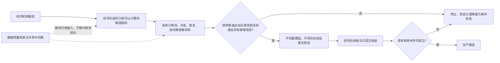
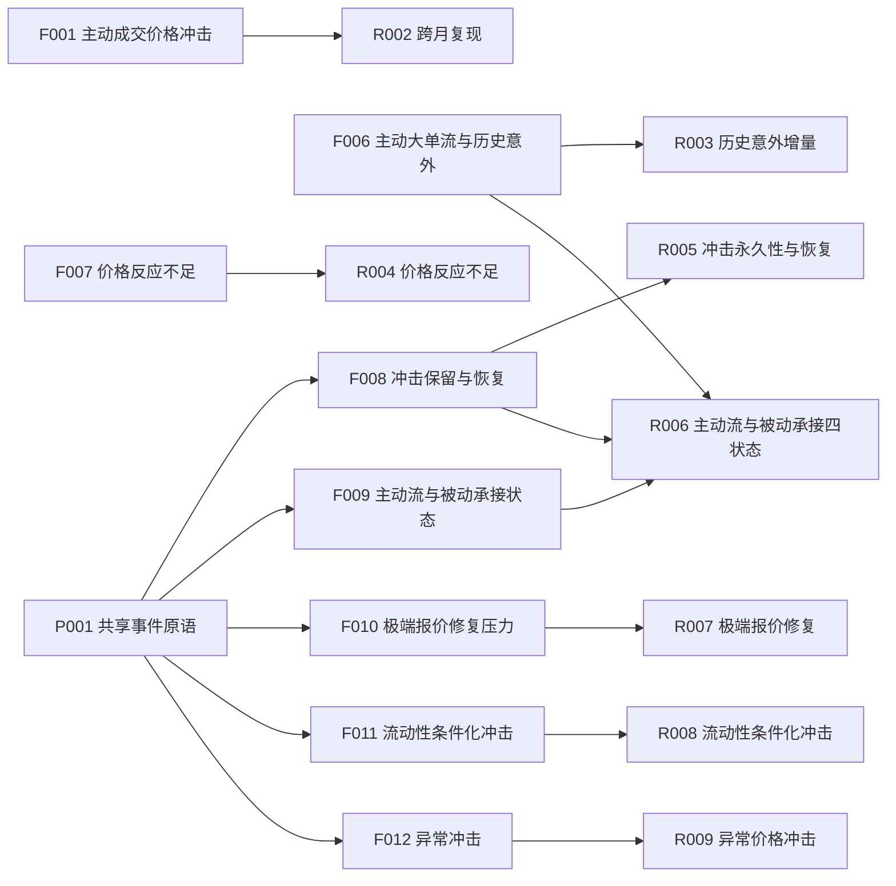
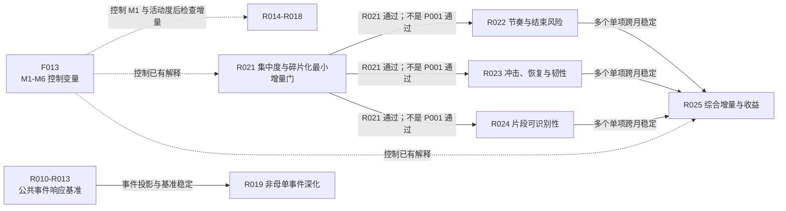
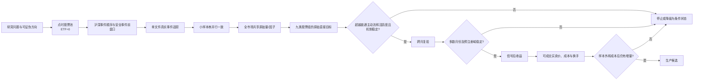

# LOB 因子挖掘决策总览：候选、证据、结论与下一步

更新日期：2026-08-09

## 1. 文档目的与边界

本文首先回答一个问题：**我们正在从 LOB 中挖什么因子，哪些方向值得继续，哪些方向应当修正或停止？**

本文以 `research/factors.json` 中正式登记的全部因子为主线，并使用研究实验作为证据索引。它说明：

1. 当前有哪些因子族、基准和候选信号；
2. 每个候选已经获得什么机制或收益证据；
3. 排除普通主动买卖流量、交易活跃度等简单解释后，是否还有新增信息；
4. 当前决定是继续、修复、等待上游还是停止；
5. 下一步最有信息价值的检验是什么；
6. 每个因子最初出现在哪份手册或设计文档，以及由哪些实验和数据检查支持。

本文是研究说明和状态快照，不替代以下正式注册表：

- 因子注册表：`research/factors.json`；
- 研究注册表：`research/experiments.json`；
- 数据产品注册表：`research/data_products.json`；
- 质量门注册表：`research/quality_gates.json`。

需要特别区分三类证据：

- **机制证据**：预测未来订单流、事件数、波动、点差、深度、盘口恢复等直接目标；
- **收益证据**：预测信号形成后的中间价收益或可成交收益；
- **生产证据**：跨月、跨域、样本外及成本后仍然成立。

除主动成交价格冲击的历史试算外，当前绝大多数结果仍属于机制证据，不能称为已确认的可交易收益因子。

正文优先使用中文名称。`F001`、`R002` 等登记号只用于在注册表、代码、运行记录和结果目录之间追溯；第一次阅读时可以忽略。一个因子可能需要多个实验才能完成机制、增量、跨月和收益检验，一个实验也可能为多个候选提供公共证据。因此不能把研究实验的数量理解为待上线因子的数量。

---

## 2. 我们到底在做什么：因子挖掘决策面板

最终目标不是完成尽可能多的研究课题，而是形成一个数量受控、定义稳定、可追溯的 LOB 因子候选池。每个候选都要经过下面的决策链：



### 2.1 因子最初出现在哪份手册

下表覆盖因子注册表中的全部正式因子。中文名称用于阅读，旧名称用于从历史文件、脚本列名和旧报告反查。

| 现在的中文名称 | 最初或主要来源文档 | 相关实验 | 历史名称 | 登记号 |
|---|---|---|---|---|
| 主动成交价格冲击 | [README 中的原始定义](../README.md)、[大价差占比因子逻辑文档](大价差占比因子逻辑文档.md) | 跨月复现（R002） | `active_take_mid_gap`、`active_gap`、AG01 | F001 |
| 被动大价差流动性供给 | [大价差占比因子逻辑文档](大价差占比因子逻辑文档.md) | 尚未单独登记；先做定义审计 | `passive_large_gap_B/S` | F002 |
| 订单行为强度与量比 | [量比与订单行为因子手册](量比与订单行为因子手册.md) | 尚未单独登记；先按修正版重算 | `vr_log`、`cr_log` | F003 |
| 价差供给与订单行为交互 | [大价差占比因子逻辑文档](大价差占比因子逻辑文档.md)、[量比与订单行为因子手册](量比与订单行为因子手册.md) | 尚未单独登记；等待被动大价差定义冻结 | `joint_large_gap`、`large_gap_x_vr` | F004 |
| 委托、撤单和成交后的中间价响应 | [Stylized Fact 4–6 日频因子手册](stylized-fact-4-6_日频因子手册.md) | 尚未单独登记；先按新事件口径重算 | D01–D03 | F005 |
| 主动大单流与历史意外 | [Stylized Fact 4–6 日频因子手册](stylized-fact-4-6_日频因子手册.md)、[日内定义交接说明](HANDOFF_D04_D06_NEXT_SESSION.md) | 历史意外研究（R003）；主动流与被动承接研究（R006） | D04、D05、ID05 | F006 |
| 主动大单价格反应不足 | [Stylized Fact 4–6 日频因子手册](stylized-fact-4-6_日频因子手册.md)、[日内定义交接说明](HANDOFF_D04_D06_NEXT_SESSION.md) | 价格反应不足研究（R004） | D06 | F007 |
| 成交冲击保留与恢复 | [Stylized Fact 4–6 日频因子手册](stylized-fact-4-6_日频因子手册.md) | 冲击延续或恢复（R005）；主动流与被动承接研究（R006） | D07 | F008 |
| 主动流与被动承接状态 | [Stylized Fact 4–6 日频因子手册](stylized-fact-4-6_日频因子手册.md) | 主动流与被动承接研究（R006） | D08 | F009 |
| 极端报价修复压力 | [Stylized Fact 4–6 日频因子手册](stylized-fact-4-6_日频因子手册.md) | 极端报价修复研究（R007） | D09 | F010 |
| 流动性条件化冲击 | [Stylized Fact 4–6 日频因子手册](stylized-fact-4-6_日频因子手册.md) | 不同流动性条件下的冲击研究（R008） | D10 | F011 |
| 订单流条件下的异常冲击 | [Stylized Fact 4–6 日频因子手册](stylized-fact-4-6_日频因子手册.md) | 异常冲击研究（R009） | D11 | F012 |
| 非母单订单状态基准 | [订单簿形态与非对称自刺激：增量因子手册](订单簿形态与非对称自刺激_增量因子手册.md) | 基线研究（R001）；在非母单候选中用普通主动流作比较（R014–R018）；在母单结构的最小检验和综合检验中作为登记的比较基准（R021、R025） | M1–M6 | F013 |
| 非母单订单状态候选 | [订单簿形态与非对称自刺激：增量因子手册](订单簿形态与非对称自刺激_增量因子手册.md)、[后续实现交接说明](HANDOFF_NON_PARENT_ORDER_SHAPE_NEXT_SESSION.md) | 五项订单状态研究（R014–R018） | NP01–NP05 | F014 |
| 非母单事件深化候选 | [后续实现交接说明](HANDOFF_NON_PARENT_ORDER_SHAPE_NEXT_SESSION.md) | 五项事件深化研究（R019） | NPE01–NPE05 | F015 |
| 逐事件盘口响应公共基准 | [Event LOB 最小实证实验方案](Event_LOB最小实证实验方案.md) | 四项公共基准实验（R010–R013） | ELOB01–ELOB04 | 无独立因子号 |
| 近端大单遮挡与深档撤单响应 | [近端大单遮挡与深档撤单响应因子设计文档](近端大单遮挡与深档撤单响应因子设计文档.md) | 大单遮挡研究（R020） | DR01–DR05 | F016 |
| 母单结构与推断执行片段 | [母单结构与执行阶段：衍生因子研究手册](母单结构与执行阶段_衍生因子研究手册.md) | 集中度、节奏、盘口恢复、片段识别和综合收益研究（R021–R025） | MSI01–MSI10 | F017 |
| 对手盘深度归一化主动流反转 | [F018候选因子档案](../research/candidate_factors/F018_minus_flow_to_opponent_depth/README.md) | R017收益深化、双边检验与涨跌停稳健性 | `-FlowToOpponentDepth` | F018 |

“相关实验”包含两种关系：一是实验直接检验该候选，二是该因子只作为比较基准。作为比较基准不表示实验在挖掘这个基准因子本身。例如母单结构研究使用普通主动买卖净流作比较，是为了判断复杂结构是否真的提供新增信息。

被动大价差流动性供给、订单行为强度与量比、两者交互、委托/撤单/成交后的中间价响应已经进入因子注册表，但当前 25 项研究实验没有为它们分别设置独立章节。它们目前处于定义审计、等待上游或按新事件口径重算阶段，因此保留在上表和候选组合中，避免从研究总览里“消失”。

### 2.2 当前因子候选组合

| 因子方向 | 现在知道什么 | 当前决策 | 下一项关键工作 | 登记号 |
|---|---|---|---|---|
| 主动成交价格冲击 | 旧版单月尾部收益较强，但旧实现把相邻一行盘口当成事件前盘口，深圳临时锁定或交叉时会出错 | **按新口径重算**，不能沿用旧收益结论 | 沪深都改用最近有效、未交叉的事件前盘口，再做跨月和可成交收益 | F001 |
| 被动大价差流动性供给 | 旧定义正在审计，尚未冻结安全版本 | **先审计定义** | 比较旧口径与安全事件前盘口口径，确认经济含义是否变化 | F002 |
| 订单行为强度与量比 | 旧版本没有始终用“买卖方向＋订单号”识别订单 | **按修正版重算** | 重算后再判断成交、撤单和报单强度是否有稳定信息 | F003 |
| 价差供给与订单行为交互 | 上游的被动大价差定义尚未冻结 | **等待上游** | 被动大价差口径确定后再固定交互项 | F004 |
| 委托、撤单和成交后的中间价响应 | 旧版事件前盘口不安全，需要重算 | **按新口径重算** | 分沪深核对委托、撤单、成交后的价格变化 | F005 |
| 主动大单流、价格反应和盘口恢复 | 主动大单流已经可以计算；冲击恢复、极端报价修复和流动性条件化结果只完成了一部分；其余定义未冻结 | **先算已就绪项，修复部分完成项** | 正式计算主动大单流；补齐上海订单余量和安全事件前盘口 | F006–F012 |
| 非母单订单状态基准 | 普通主动买卖净流是强基准；部分旧假说失败；成交机会控制普通主动流后只剩小幅信息 | **保留为比较基准，不包装成新收益因子** | 所有新候选都报告扣除普通主动流和活跃度前后的结果 | F013 |
| 非母单订单状态候选 | 固定 10:30 全市场九分域初筛已完成：成交机会方向增量失败；总体可成交性、确认状态和盘口—成交流背离通过单月机制门；撤单课题被深圳零价格语义缺陷阻断 | **三项进入跨月、一项停止、一项修复** | 优先跨月复现 R017/R015/R016；修复撤单价格后单独重算 R018 | F014 |
| 逐事件盘口响应公共基准 | 用于回答下一次和随后几次价格如何变化、信号多久兑现、不同事件如何影响价格 | **这是公共证据，不是待上线因子** | 共享事件表稳定后完成四项最小实证 | R010–R013 |
| 非母单事件深化 | 只有研究动机和定义，尚无正式结果 | **等待公共事件基准** | 公共事件结果稳定后再实现，避免重复扫描和口径分叉 | F015 |
| 近端大单遮挡 | 设计完整，但没有正式机制证据 | **先做小规模机制检验** | 检查近端大单出现后，深档订单是否更容易撤单、更难成交 | F016 |
| 对手盘深度归一化主动流反转 | 2026年1月九域Rank IC在5/10/30分钟分别为0.0314/0.0396/0.0232；卖压反弹尾部较强，涨跌停剔除后保留 | **登记为单月候选，不晋级生产** | 冻结定义跨月复现，并完成原始Flow5、信号前收益、流动性、成本和容量增量检验 | F018 |
| 母单结构与推断执行片段 | 只能从公开事件推断执行片段，不能识别真实投资者母单；旧“链净流”大部分只是普通主动流和活跃度 | **只做最小新增信息检验** | 先检查集中度、碎片化和节奏是否真的超越普通主动流；失败就停止复杂模型 | F017 |

### 2.3 如何理解“完成”和“成功”

- **实验完成**只表示按事先规定的方法给出了结果，不表示对应候选已经成为有效因子。
- **机制通过**表示候选能预测事先规定的未来订单流、盘口或波动，而且不是普通主动买卖净流、交易活跃度或盘口水平的简单改名。
- **收益通过**表示信号形成之后的收益方向稳定，不使用未来窗口筛样本或选择阈值。
- **生产候选**还必须通过跨月、九类股票组、样本外、可成交报价、成本、换手和多重检验。
- **停止也是有效产出**。例如部分相对刺激和集中度假说没有复现原方向，应记录停止，而不是更换标签后继续寻找显著结果。

### 2.4 当前最短执行路径

当前最有信息价值的顺序是：

1. 跨月复现已经通过单月直接目标门的 R017、R015 和 R016；
2. 同时正式计算已经就绪的主动大单流（登记 F006）；
3. 修复主动成交冲击、冲击恢复、极端报价修复和流动性条件化冲击的沪深事件口径后重算；
4. 稳定共享事件表，完成四项逐事件盘口响应基准；
5. 修复深圳撤单价格恢复链路后，以新运行号单独重算 R018；R014 方向假说停止；
6. 对母单结构与推断执行片段先检查集中度和碎片化是否有新增信息；未通过就停止更复杂的片段研究。

后文第 3 节给出统一口径，第 4 节是实验与证据索引，第 5–10 节保存逐项方法和结论，第 12 节记录工程依赖，第 13 节记录执行顺序。

---

## 3. 全部因子候选与实验的统一计算口径

### 3.1 股票池与时间边界

- 使用点时点证券主数据生成的沪深 A 股股票清单，因子计算前排除 ETF；正式产物要求 `ETF=0`。
- 不使用 `event_depth10_v4/<month>/*.parquet` 无限制通配作为股票池。
- 主要日内信号窗口为 `[10:00,10:30)`；非母单订单状态的过去窗口为 `(t-60s,t)`，未来直接目标为 `[t,t+10m)`。
- 时点 `t` 的事件只能进入未来标签，不能进入过去特征。
- 日内风格和九分域暴露默认使用前一交易日可得数据。
- 每个收益期限独立处理缺失标签，不能先取所有未来期限的共同非空样本。

### 3.2 沪深事件顺序与事件前盘口

V4 每一行记录的都是事件发生后的盘口。计算某个事件造成的变化时，必须使用同一股票、交易日和连续竞价时段内最近的有效、未交叉盘口作为“事件前盘口”（代码中称为 `pre-book` 或 `safe pre-book`）。缺失、买卖一价相同、买卖价格交叉的行不能替代最近的有效盘口；午休、收盘和换日必须重新开始记录。

主动订单键统一为：

\[
OrderKey=(source\_side, ActiveOrderId)
\]

其中买侧取 `source_buy_order_id`，卖侧取 `source_sell_order_id`。买卖订单号空间不能混用，也不能按成交行数重复计算一个主动订单。

- 上海常见顺序是立即成交 `TRADE(s)` 在前、未成交余量 `ORDER_ADD` 在后。后置余量属于同一个主动订单，不能再次算作被动挂单。
- 深圳常见顺序是完整 `ORDER_ADD` 在前、子成交 `TRADE(s)` 在后，中间可能出现临时锁定或交叉 post-book。路径特征比较临时无效链之前的最后有效盘口和链之后的首个有效盘口，不能重排事件。
- `source_link_status`、FULL/PARTIAL 和未来 recid 链接只能用于离线审计，不能进入点时因子。

### 3.3 九类股票组是主研究维度

使用前一交易日市值分组：

1. `<50亿元`；
2. `50–500亿元`；
3. `>=500亿元`。

与价格/板块分组组合：

1. 非科创板、价格 `<10`；
2. 非科创板、价格 `>=10`；
3. 科创板、价格 `>=10`。

上述两种分类交叉形成九类事先固定的股票组。九类结果必须逐一报告，全市场平均不能掩盖不同股票组方向相反。交易所差异仍需报告，但必须先排除沪深消息发布顺序和事件前盘口处理方式造成的机械差异。

仓库当前默认以各股票组内 **未经回测中性化的原始结果** 作为第一层证据。风格中性化只能作为单独标注的补充检查，不能取代原始结果。某些候选定义本身会扣除历史基准，这属于信号的计算方法，不等于回测阶段自动中性化。

### 3.4 统一研究漏斗

每个候选原则上按以下顺序推进：

1. 字段、事件顺序、时间边界和 ETF 审计；
2. 单文件真实事件核对；
3. 约 12 只股票的小样本及串并行逐字段一致性；
4. 全市场共享原始量或因子计算；
5. 九域内直接目标检验；
6. 扣除普通主动买卖净流、交易活跃度和必要的已有基准后，检查是否仍有新增信息；
7. 形成继续/停止清单；
8. 只有通过机制闸门的候选才接收益；
9. 最后检查可成交报价、跨月、成本、多重检验和样本外稳定性。

---

## 4. 实验与证据索引

本节只用于追溯实验，不代表 25 个并列的因子候选。判断当前因子组合和研究优先级时，应先看第 2 节；需要了解某项结论由哪个实验产生时，再查本表。登记号和旧称集中放在第二列。

| 实验内容 | 登记号和旧称 | 当前状态 | 关键依赖 | 现有证据层级 |
|---|---|---|---|---|
| 订单形态六机制基线 | R001；M1–M6 | 已完成 | F013、P002 | 直接目标机制 |
| 主动成交价格冲击跨月复现 | R002；AG01 | 等待重算 | F001 | 单月初步收益 |
| 主动大单流与历史意外 | R003；ID05 | 可启动 | F006 | 定义与代码完成 |
| 主动大单价格是否反应不足 | R004；D06 | 定义待定 | F007 | 研究假说 |
| 成交冲击会延续还是恢复 | R005；D07 | 等待上海重算 | F008、P001 | 深圳机制 |
| 主动流与被动承接四状态 | R006；D08 | 等待上游 | F006、F008、F009 | 研究假说 |
| 极端报价出现后如何修复 | R007；D09 | 部分完成 | F010、P001 | 深圳机制，上海待修 |
| 不同流动性条件下的价格冲击 | R008；D10 | 部分完成 | F011、P001 | 深圳机制，上海待修 |
| 扣除正常订单流后的异常冲击 | R009；D11 | 等待上游 | F012、P001 | 研究假说 |
| 盘口不平衡和价差如何影响下一次中价 | R010；ELOB01 | 计划中 | P001 | 无正式结果 |
| 随后几次价格变化是否延续 | R011；ELOB02 | 计划中 | P001 | 无正式结果 |
| 盘口信号需要多久兑现 | R012；ELOB03 | 计划中 | P001 | 无正式结果 |
| 报单、撤单和成交如何影响后续价格 | R013；ELOB04 | 计划中 | P001 | 无正式结果 |
| 超出历史预期的成交机会 | R014；NP01 | 单月全市场完成，方向课题停止 | F014、P002 | 控制 M1 三次项后方向增量未复现 |
| 盘口总体是否容易成交 | R015；NP02 | 单月机制通过，待跨月 | F014、P002 | 活动量和事件数九域同号 |
| 主动流和成交机会相互确认还是冲突 | R016；NP03 | 单月条件状态通过，待跨月 | F014、P002 | 同向未来流 8/9 域为正 |
| 盘口方向与实际成交流向背离 | R017；NP04、F018 | 单月机制通过并产生收益候选F018 | F014、F018、P003 | 背离机制9/9域同号；F018的5/10/30分钟九域Rank IC为正 |
| 两侧撤单强度与流动性风险 | R018；NP05 | **暂缓**；现有结果作废 | F014、P002 | Q005：深圳撤单价格为零导致买卖侧退化，修复后再重算 |
| 非母单事件的五项深化研究 | R019；NPE01–05 | 等待上游 | F015、P001 | 无正式结果 |
| 近端大单是否促使深档订单撤单 | R020；DR01–05 | 计划中 | F016、P001 | 完整设计，无结果 |
| 成交是否集中在少数订单链 | R021；MSI-A | 计划中 | F017、F013、P001 | 旧链流可被普通主动流解释 |
| 执行节奏能否判断继续或结束 | R022；MSI-B | 等待 R021 | F017、R021 | 无正式结果 |
| 盘口会被持续穿透还是逐渐吸收 | R023；MSI-C | 等待 R021 | F017、R021 | 无正式结果 |
| 能否稳定识别推断执行片段 | R024；MSI-D | 等待 R021 | F017、R021 | 无正式结果 |
| 执行结构能否形成新增收益信息 | R025；MSI-E | 最终检验 | R021–R024、F013 | 无正式结果 |

---

## 5. 第一批基线证据：非母单状态与主动成交冲击

### 5.1 订单形态六机制基线（研究登记 R001；旧称 M1–M6）

**研究问题**

订单流、盘口、活动度和被动订单成交机会之间，是否存在跨九域稳定的条件机制？它同时是 NP 和 MSI 系列的共同基准。

**计算方式**

样本为 2026-01 的 300 只点时点 A 股、20 个交易日、每日 21 个固定信号时点。过去特征窗口为 `(t-60s,t)`，直接目标为 `[t,t+10m)`。

普通主动流基准：

\[
M1_t=\frac{ActiveBuyVolume_t-ActiveSellVolume_t}
{ActiveBuyVolume_t+ActiveSellVolume_t+\varepsilon}
\]

M2/M3研究相对刺激和上涨刺激集中度；M4研究强主动流与薄盘口交互；M5研究交易热度与厚盘口状态；M6使用前一交易日及以前被动挂单结果估计买卖两侧成交机会。正向执行压力定义为：

\[
ExecutionPressure_t=PredFillSell_t-PredFillBuy_t
\]

注意缓存中的 `fill_opportunity_diff` 与上式符号相反。

**目前进展与结论**

- M1 对未来 10 分钟主动流的域中性 IC 约为 `0.1412`，九域和 21 个时点方向一致，是强基准。
- M2 买侧相对刺激未复现预设方向，停止原规格。
- M3 上涨刺激集中度未复现；事件时钟只缩小反向结果，停止原规格。
- M4 总体方向与“高强度薄簿”假设相反，低价非科创板是例外。
- M5 对未来 log depth 总体约 `+0.048`，只有 5/9 域较稳定。
- M6 原始 IC 约 `0.0788`；控制三次 M1 后约 `0.0093`，`t=2.40`。
- 三档盘口不平衡预测未来盘口 IC 约 `0.2272`，预测未来主动流 IC 约 `-0.1536`。
- 带方向撤单差预测未来实现波动 IC 约 `0.2820`，但方向解释需要镜像验证。

以上均为直接目标，不是未来收益结论。

**对因子研究的启示**

1. M1 是所有订单结构候选必须超越的基准，不能把活跃度换名后称为新因子。
2. 强 raw IC 在控制 M1 后可能只剩很小增量，增量检验比单变量显著更重要。
3. M4/M5提示价格、tick、市值和深度会改变机制，九域差异不是噪声。
4. 盘口持续而主动流反向响应，说明“盘口—成交流背离”比简单同号组合更值得研究。

### 5.2 主动成交价格冲击能否跨月复现（研究登记 R002；旧称 AG01）

**研究问题**

主动成交直接推动中间价的极端效应，能否跨月延续，并在可成交价格和成本口径下保持？

**计算方式**

对每个主动成交事件，以最近有效、未交叉的事件前盘口计算中间价变化 `delta_mid`。主变量包括：

\[
ActiveAbs=\sum_{j\in ActiveTake}|\Delta Mid_j|
\]

\[
ActiveRatio=\frac{\sum_{j\in ActiveTake}|\Delta Mid_j|}
{\sum_{j\in AllEvents}|\Delta Mid_j|+\varepsilon}
\]

以及有符号版本 `sum(delta_mid)`。10:00–10:30 形成信号，检验未来 5/10/15/30 分钟未经中性化的排序相关、最高组减最低组收益，以及最高组和最低组各自的收益；极端组比例事先固定为 10%、20% 或 30%。

**目前进展与结论**

历史 2026-01 结果中，`old_active_abs` 的 raw D10-D1：未来 10 分钟约 `15.16 bp`、`t=3.99`；未来 15 分钟约 `21.19 bp`、`t=3.69`。ratio 较弱，有符号版本弱。形状更像极端尾部效应而不是线性排序。

但旧实现直接依赖相邻盘口，受到深圳事件后的临时无效盘口影响。主动成交价格冲击已经登记为必须按安全事件前盘口重算，因此旧收益只能视为候选线索。

**对因子研究的启示**

- 绝对冲击强度可能比方向更重要，反映信息到达、脆弱性或高活跃状态。
- 显著 D10-D1 但弱线性 IC 通常意味着尾部/阈值结构，应预注册尾宽而非事后选择。
- 这是当前最接近收益候选的方向，但只有跨月、可执行收益和成本后仍成立才能升级。

---

## 6. 主动流、价格冲击与盘口恢复

本章对应因子登记 F006–F012。旧手册中的名称为 D04–D11，只在标题中保留以便反查。

### 6.1 主动大单流与历史意外（研究登记 R003；旧称 D04/D05）

**研究问题**

异常主动大单流相对原始主动流是否有增量？相对自身历史异常、加速或持续的主动大单流，是否进一步预测未来订单流或收益？

**计算方式**

先根据只用 `d-1` 及以前数据的大单阈值统计主动大买和主动大卖，形成 `ALF`。D04 是 ALF 对收益、流动性、波动、市值、行业和板块等可得控制量的截面残差：

\[
D04_{i,d}=ALF_{i,d}-\widehat{ALF}_{i,d}(Controls)
\]

D05 的核心历史意外为：

\[
D05_{i,d}=\frac{D04_{i,d}-EWMA_{60}(D04_i)}
{\sigma_{60}(D04_i)+\varepsilon}
\]

并保留 `EWMA3-EWMA20` 加速度、5期持续性、买卖侧 surprise。日内版固定 10:00–10:30，必须具备 60 个严格滞后的同窗口历史观测。

**目前进展与结论**

F006 定义、计算代码和测试已就绪，但尚无正式全市场日内因子和收益结果。既有同期相关只能支持“主动大单与价格冲击相关”，不能支持未来收益。

**对因子研究的启示**

- D04 的残差化是因子定义，不应再隐藏原始 `alf_raw`；两者必须并列报告。
- D05只有在超越 `alf_raw` 和 D04 后才有研究价值，否则只是历史标准化。
- 这是可立即启动、计算成本相对可控的课题。

### 6.2 主动大单价格是否反应不足（研究登记 R004；旧称 D06）

**研究问题**

给定异常主动大单流，10:30 前价格反应不足是否预示之后补涨/补跌，反应过度是否预示冲击消退？

**计算方式**

候选方案是将 10:00–10:30 的 D04 与同窗口已实现价格反应构造二维状态，或用严格历史模型估计正常价格响应并取残差。禁止用两个 z-score 相除，也禁止使用 10:30 后价格构造信号。

**目前进展与结论**

F007 尚未实现，点时定义未冻结。日频手册的同步关系约 `+0.65` 只说明主动大单与当日收益同向，不能直接搬成日内未来收益因子。

**对因子研究的启示**

- “流量强但价格不动”可能是隐藏流动性、吸收或尚未兑现，需要和“流量与价格均强”分开。
- 二维状态比不稳定的比值因子更可解释。
- 在定义冻结前不应提交大规模计算。

### 6.3 成交冲击会延续还是恢复（研究登记 R005；旧称 D07）

**研究问题**

主动大单的即时冲击在未来是继续、一次性保留还是反转？沪深是否一致？

**计算方式**

对主动大单事件 `j`：

\[
ImmediateImpact_j=Mid_{j+}-Mid_{j-}
\]

\[
RetainedImpact_{j,h}=Mid_{j+h}-Mid_{j-}
\]

\[
PermanentRatio_{j,h}=clip\left(
\frac{RetainedImpact_{j,h}}{ImmediateImpact_j+\varepsilon},-c,c\right)
\]

同时输出 5/30/60 秒、固定事件数的逐事件版本和 atomic-chain 版本，再在 10:30 聚合预测未来 5/10/15/30 分钟。

**目前进展与结论**

深圳 safe-prebook 第一层已有 97,776 个完整股票日、2,884 只股票、ETF=0；5/30/60 秒平均冲击后漂移为正，更接近短期延续，不支持无条件反转。上海仍需修复后置主动余量和统一路径口径，F008 状态为重算所需。

**对因子研究的启示**

- 不能把所有大冲击都解释为反转；必须区分冲击保留、吸收和恢复。
- 交易所差异在语义修复前不能解释为经济差异。
- D07更适合作为其他状态因子的条件变量，而非单独规定固定多空方向。

### 6.4 主动流和被动承接的四种状态（研究登记 R006；旧称 D08）

**研究问题**

主动大单与被动小单报价改善形成的趋势一致、承接和吸收状态，是否具有不同的冲击保留和未来响应？

**计算方式**

以 D04 表示异常主动大单方向，以 PSF 表示被动小单报价改善方向，构造四个状态：买方一致、卖方一致、买方承接、卖方吸收。使用四个哑变量或二维分组，不能简单压缩为 `D04-PSF`。再用 D07 区分承接成功和失败。

**目前进展与结论**

F009 未定义，且依赖 F006 和 F008 定版，因此尚无正式结果。既有订单行为相关支持两种市场功能不同，但不决定未来收益方向。

**对因子研究的启示**

- 主动流是流动性消耗，被动改善是流动性供给，两者不能当成对称方向因子。
- 状态交互可能比单变量更有解释力；收益方向必须由恢复路径决定。

### 6.5 极端报价出现后如何修复（研究登记 R007；旧称 D09）

**研究问题**

价差内形成的新最优挡位如果相对很薄，是否更容易被再次命中、成交移除并恢复到原盘口？

**计算方式**

每个改善报价事件记录事件前盘口、新最优价、相对历史/附近深度、存活时间、首次再命中、撤单、追加、完全消耗和恢复原盘口。主直接目标为 5秒、30秒、1分钟和固定事件数的存活率、再命中率、成交移除率和恢复率。

所有路径使用安全 pre-book；上海必须排除主动成交后的余量 `ORDER_ADD`，深圳必须跨临时无效链取首个有效 post-book。

**目前进展与结论**

深圳第一层结果显示极薄新挡位更易再命中、成交移除并恢复原盘口。旧上海结果中，极薄组相对 50%–100% 深度组的成交移除率高 `7.94` 个百分点、恢复率高 `9.78` 个百分点、生命周期短 `3.29` 秒；但上海小样本审计发现旧候选中约 `46.4%` 是主动余量，因此上海结论必须重算后确认。

**对因子研究的启示**

- 静态一档深度不够；报价脆弱度、存活、再命中和恢复速度更接近可交易状态变量。
- 稀疏极端状态必须同时报告样本量，不能因结果显著而保留事后分组。

### 6.6 不同流动性条件下的价格冲击（研究登记 R008；旧称 D10）

**研究问题**

价格、tick、市值和新挡位深度如何改变冲击的延续、吸收和反转？

**计算方式**

将主动流/冲击与 spread、depth、Amihud、换手和波动等流动性状态交互；事件层优先使用价格×市值×新挡位相对深度分层。高流动性下检验信息型延续，低流动性且冲击极端时检验机械冲击恢复。

**目前进展与结论**

深圳第一层显示：低价组内大市值仍提供条件增量；价格效应总体大于市值效应。上海旧结果也显示低价大市值组最突出，但需在报价生命周期修复后重新确认。当前没有正式未来收益结论。

**对因子研究的启示**

- 低价/tick约束和市值共同决定盘口弹性，九域是机制核心而不是纯风险控制。
- D10应以条件状态或交互因子呈现，不能把某个成功域当作全市场结论。

### 6.7 扣除正常订单流后的异常价格冲击（研究登记 R009；旧称 D11）

**研究问题**

给定正常订单流、深度和价差后，异常大的成交/委托冲击是否预测未来流动性、波动和收益？

**计算方式**

成交端示意：

\[
TradeImpact=\alpha+\beta_1 ALF+\beta_2Depth+\beta_3Spread+\beta_4Volume+\epsilon^{trade}
\]

以 `epsilon_trade` 为异常成交冲击；委托端以 PSF、depth、spread 解释 order impact，取 `epsilon_order`。日内模型参数只能使用历史训练，并同时报告未残差化 primitive。

**目前进展与结论**

F012 未实现，依赖稳定的 D07/D09/P001 原语，尚无正式结果。

**对因子研究的启示**

- 残差首先代表冲击效率或盘口脆弱性，优先预测波动、点差和深度，而不是直接声称知情交易。
- 与 D07 联合可区分“冲击大且永久”和“冲击大但迅速恢复”。

---

## 7. 公共机制基准：逐事件观察盘口和价格反应

这四项研究不是新因子，而是为后续候选建立公共参照：盘口失衡后下一次和随后几次价格怎样变化、信息多久兑现，以及报单、撤单和成交是否有不同影响。四项研究共用同一张事件表。主统计先在每只股票的每个交易日内计算，再对股票日等权汇总；把所有事件混在一起的统计只作对照；置信区间至少按交易日分块重复抽样。

基础变量：

\[
Mid_t=\frac{Ask1_t+Bid1_t}{2},\quad
SpreadTicks_t=\frac{Ask1_t-Bid1_t}{TickSize}
\]

\[
Imbalance_t=\frac{BidVol1_t-AskVol1_t}{BidVol1_t+AskVol1_t}
\]

### 7.1 盘口买卖不平衡和价差如何影响下一次中价（研究登记 R010）

**计算方式**

将 imbalance 主规格分 10 档、20 档作稳健性，spread 分为 1/2/3/4/5+ ticks。标签为下一次有效中价变化是否向上：

\[
Y_t^{up}=1(M_{\tau_1}>M_t)
\]

输出条件上涨概率曲线，并估计：

\[
logitP(Y^{up}=1)=\alpha+\beta_1z+\beta_2S+\beta_3zS
\]

**进展、结论与启示**

正式实验未启动，无结论。它是最小方向信息检验：如果关系不单调、不跨月或只存在于稀疏状态，后续复杂 micro-price 因子不应推进。

### 7.2 随后几次价格变化是否延续（研究登记 R011）

**计算方式**

定义未来第 `k` 次 mid move 后累计响应：

\[
R_k(z,S)=E[M_{\tau_k}-M_t\mid z_t=z,S_t=S],\quad k\in\{1,2,3,5,10\}
\]

按曲线分为持续型、一次性型和反转型。

**进展、结论与启示**

尚未启动。该课题决定盘口方向信号的持有事件数，也能防止把“只预测下一跳”误写为中期动量。

### 7.3 盘口信号需要多久兑现（研究登记 R012）

**计算方式**

等待时间 `T=tau_1-t`，统计 1/5/10/30/60 秒内首次 mid move 概率、中位等待时间和 Kaplan–Meier 曲线；分别处理首次上涨与首次下跌的竞争风险。

**进展、结论与启示**

尚未启动。方向正确但兑现过慢的状态可能没有 T0 价值；事件时间稳定也不代表自然时间可交易。

### 7.4 报单、撤单和成交分别怎样影响后续价格（研究登记 R013）

**计算方式**

事件规模用事件前同侧最优队列标准化：

\[
RelativeSize_t=\frac{EventSize_t}{QueueSize_{t-}}
\]

分别计算未来 1/2/5/10/20/50/100 个事件和 1/5/10/30/60 秒的累计中价响应；做买卖镜像及 imbalance/spread 交互。

**进展、结论与启示**

尚未启动。它为 NPE、D07、D09/D10 提供共同基准：相同盘口变化由 Add、Cancel 或 Trade 触发时，信息含量和恢复路径可能不同。

---

## 8. 非母单订单状态候选

本章对应因子登记 F014。这五项不研究隐藏母单。R014–R017 读取已经审计完成的固定 10:30 共享缓存；R018 因深圳撤单价格语义缺陷需要单独修复原始事件投影后重算。2026 年 1 月正式候选为 101,383 个股票日、5,133 只股票、20 个交易日。完整结论见 [非母单固定 10:30 全市场九分域研究结论](RESEARCH_NON_PARENT_FIXED_1030_202601_FINDINGS.md)。

### 8.1 超出历史预期的成交机会（研究登记 R014；旧称 NP01）

**计算方式**

\[
ExecutionPressure_t=PredFillSell_t-PredFillBuy_t
\]

在日期×时点×域内控制 `M1, M1^2, M1^3` 和预注册控制量：

\[
NP01=ExecutionPressure-\widehat{ExecutionPressure}(M1,M1^2,M1^3,Controls)
\]

先预测未来 10 分钟主动净流、主动量和事件数，再决定是否接 1/5/10 分钟收益。

**进展与结论**

全市场 101,383 个股票日、20 日、九分域 raw 初筛已完成。原始成交机会压力对未来主动净流 IC 为 `0.0629`（`t=8.98`）；控制 M1、M1²、M1³ 后变为 `-0.0110`（`t=-1.99`），仅 3/9 域为正。历史 300 股的正增量没有复现，R014 方向课题按规则停止。残差对未来主动量仍为正（IC `0.0270`，`t=6.98`，8/9 域为正），只保留为无方向活动状态线索。

**因子启示与闸门**

如果全市场或跨月不能复现稳定的未来订单流增量，直接停止，不通过调整符号、分组或模型复杂度挽救。

### 8.2 盘口总体是否容易成交（研究登记 R015；旧称 NP02）

**计算方式**

\[
FillabilityLevel=\frac{PredFillBuy+PredFillSell}{2}
\]

另做两侧 logit 均值稳健版本。控制当前主动量/笔数、两侧历史样本数、spread、三档深度、时段和域，预测未来事件数、成交量、波动、点差和深度。

**进展、结论与启示**

单月九分域机制通过。控制当前活动和盘口后的残差，对未来主动量 IC 为 `0.1177`（`t=28.37`，9/9 域为正），对事件数为 `0.1382`（`t=34.19`，9/9 域为正），对实现波动为 `0.0694`（`t=17.72`，8/9 域为正）。它应作为活动度、波动和容量状态，进入跨月复现；不应强行方向化。

### 8.3 主动流和成交机会相互确认还是冲突（研究登记 R016；旧称 NP03）

**计算方式**

连续交互：

\[
Confirmation=M1\times ExecutionPressure
\]

同时构造预注册四状态：两者同向且强、M1弱/M6强、M1强/M6反向、两者均弱。优先检验 `M1强、M6反向` 是否对应订单流衰减或价格反转。

**进展、结论与启示**

多尺度窗口重算已完成。九分域聚合中，1分钟、5分钟、30分钟确认度对未来10分钟同向流IC分别为`0.0472`、`0.0631`、`0.0688`；5分钟和30分钟版本均优于旧口径，沪深同号。但大市值非STAR低价域略为负，小市值域偏弱，说明它是有域差异的方向确认条件，不是简单线性方向因子。确认度对未来活动量和波动仍总体为负。下一步补充分段成交机会和`FillSurprise`，跨月稳定前不接收益包装。

### 8.4 盘口方向与实际成交流向背离（研究登记 R017；旧称 NP04）

**计算方式**

\[
BookImbalance3=\frac{BidDepth3-AskDepth3}{BidDepth3+AskDepth3}
\]

构造 M1×BookImbalance3 二维状态，以及当前主动流相对历史盘口—流量关系的残差。先预测未来盘口、主动流和波动，再接收益。

**进展与结论**

多尺度窗口重算强化了机制证据。最近5分钟TWAP盘口对未来1分钟盘口IC为`0.4682`，优于末端截面的`0.4502`；完整30分钟TWAP对未来10分钟盘口IC为`0.3121`，优于末端截面的`0.2350`。5分钟flow-minus-book残差对未来10分钟主动净流IC为`0.1392`，控制旧1分钟流后仍为`0.0779`，九域和沪深均同号。更关键的是，5分钟盘口控制原始5分钟流后仍以`-0.1939`预测未来10分钟主动流，证明盘口不是流量重包装。单一背离残差控制原始5分钟流后方向翻转，因此不再把任意固定权重的单残差包装为alpha。

后续收益深化从二维机制中形成F018“对手盘深度归一化主动流反转”。其九分域聚合Rank IC在10:31–10:35、10:31–10:40和10:31–11:00分别为`0.0314`、`0.0396`和`0.0232`，t值为`2.60`、`2.57`和`2.15`；至收盘衰减为`0.0113`（t=`0.74`）。卖压反弹的5分钟D10-D1为`5.46bp`（t=`2.31`），严格检查涨跌停后仍约`5.35bp`（t=`2.19`）。F018因此登记为单月候选，而不是生产因子。完整冻结定义和晋级闸门见[F018候选因子档案](../research/candidate_factors/F018_minus_flow_to_opponent_depth/README.md)。

**因子启示与闸门**

机制价值在“状态背离”而不是把盘口不平衡重新缩放；收益候选价值集中在F018的5至30分钟连续排序。F018必须冻结定义跨月复现，并完成原始Flow5、信号前收益、流动性、交易成本和容量增量检验。被排除、降级或暂缓的派生方向统一进入[候选因子研究缓冲区](CANDIDATE_FACTOR_RESEARCH_BUFFER.md)。

### 8.5 两侧撤单强度与流动性风险（研究登记 R018；旧称 NP05）

**计算方式**

\[
CancelIntensity=\frac{NearCancelBuy+NearCancelSell}
{BidDepth3+AskDepth3+\varepsilon}
\]

\[
AbsCancelImbalance=\frac{|NearCancelSell-NearCancelBuy|}
{NearCancelSell+NearCancelBuy+\varepsilon}
\]

同时保留买侧/卖侧按本侧深度归一化的 shock。主目标是未来实现波动、点差扩大和深度下降，而非涨跌方向。

**进展与结论**

R018 标注为**暂缓**，现有结果作废。原始事件审计显示深圳 `CANCEL` 行方向和订单 ID 正常，但 `source_price=0`；当前近端判断因而漏掉全部深圳买撤单并机械收入卖撤单。修复必须从此前同侧订单状态恢复价格，完成镜像和串并行测试后以新运行号重算。

**因子启示与闸门**

必须通过买卖镜像：对称量交换后不变，有符号量严格反号；总量和方向差分别入模。只有旧带方向版本有效而对称版本失效时，应停止通用解释。

---

## 9. 非母单事件深化与大单遮挡

本章对应因子登记 F015–F016。

### 9.1 非母单事件的五项深化研究（研究登记 R019；旧称 NPE01–NPE05）

R019包含五个共享一次 P001 扫描的子问题：

| 子方向 | 核心计算 | 主要直接目标 |
|---|---|---|
| NPE01 流动性吸收 | 主动量相对中价变化和深度损失 | 后续延续/反转、恢复 |
| NPE02 冲击效率 | 单位主动量价格变化、穿透档位 | 价格脆弱性 |
| NPE03 历史恢复能力 | 已完成冲击后的补单、点差和深度恢复 | 后续成本与韧性 |
| NPE04 日内热度惊奇 | 当前事件数/成交量相对历史同时段基线 | 未来活动和波动 |
| NPE05 秒时钟与事件时钟差异 | 同一状态在自然时间和事件时间的差 | 活动压缩和波动 |

**目前进展与结论**

F015 尚未实现，依赖 P001 事件投影稳定。现有 M4/M5 和 D07–D10 结果只提供研究动机，尚无 R019 正式结论。

**对因子研究的启示**

相同主动流对价格的作用取决于吸收、穿透和恢复；这些变量有机会比继续构造更多净流指标更具增量。单月或单域显著不能直接进入收益阶段。

### 9.2 近端大单是否促使深档订单撤单（研究登记 R020；旧称 DR01–DR05）

**研究问题**

近端异常被动大单出现后，价格优先是否降低同侧更差价格既有订单的成交机会，进而提高这些深档订单的异常撤单风险？

**计算方式**

主触发为买/卖侧前 2 档的原价扩量被动订单。规模必须同时满足历史同类订单前 5% 且不低于该位置典型深度；历史阈值只用 `d-1` 及以前数据。目标集合只包含触发前已存在、同侧、严格劣于触发价且在后方 1–5 ticks 的订单。

事件级撤单率：

\[
C_e^{deep}(h)=\frac{\sum_{o\in O_e^{deep}}CancelQty_o}
{\sum_{o\in O_e^{deep}}RemainingQty_{o,e}+\varepsilon}
\]

以仅含事件前变量的历史模型估计基准撤单率，形成：

\[
ACR_e=C_e^{deep}-\widehat C_e^{base}(X_e^{pre})
\]

再聚合为 DR01 无方向异常响应、DR02 买卖方向差、DR03 持续大单可信度、DR04 大单消失后的流动性空洞、DR05 规模—撤单响应弹性。

**目前进展与结论**

F016 只有完整设计，尚未实现和计算。目前不能声称遮挡机制存在。

**对因子研究的启示与停止规则**

最小实验必须同时看到：事件后撤单风险上升、成交或触价风险下降、效应随大单规模和持续性增强、事件前不存在同样趋势。若最小版本失败，不进入复杂订单生命周期和收益优化。

---

## 10. 母单结构与推断执行片段

公开 LOB 能直接看到的是订单链 L0，可以算法推断市场级同向片段 L1，但不能恢复真实投资者意图 L2。因此本文避免把单一 `active_order_id` 或算法片段直接称为真实母单。

现有 2026-01、300股结果中，固定时点 `chain_flow` 的域中性 IC 为 `0.1406`，但控制普通主动流和四风格后变为 `-0.0083`；M1和控制变量解释约 `98.5%` 的域内截面方差。这否定的是“链净流重新命名”，不是所有链结构。

本章对应因子登记 F017，研究可观测订单与成交是否形成具有新增信息的执行结构。这里的“母单结构”是经济假说，“推断执行片段”是可检验对象；即使规则能够恢复某种片段，也不能据此声称识别了真实投资者母单。

### 10.1 成交是否集中在少数订单链（研究登记 R021；旧称 MSI-A）

**计算方式**

\[
ChainHHI=\sum_i\left(\frac{V_i}{\sum_jV_j}\right)^2,
\quad MaxChainShare=\frac{\max_iV_i}{\sum_jV_j}
\]

\[
Fragmentation=\frac{K}{\log(1+ActiveVolume)},
\quad ChainEntropy=-\sum_i p_i\log p_i
\]

所有变量在日期×时点×域内控制 M1、M1非线性、活动度、spread、depth 和必要风格，检验控制后直接目标增量。

**进展、结论与启示**

F017尚未实现，正式R021未启动。它是整个母单结构与推断执行片段系列的第一道闸门：如果集中度、碎片化和熵仍被 M1/活动度解释，R022–R025不应投入复杂模型。

### 10.2 执行节奏能否判断继续或结束（研究登记 R022；旧称 MSI-B）

**计算方式**

\[
TempoAcceleration=\log\frac{\lambda_{late}+\varepsilon}
{\lambda_{early}+\varepsilon}
\]

并使用 `d-1` 及以前片段估计 continuation probability 和 termination hazard。输入只能包括截至当前可知的持续时间、子成交数、节奏、价格推进、反向流和盘口，不能使用最终片段长度。

**进展、结论与启示**

等待 R021。先使用历史条件表或生存模型；只有样本外优于简单持续时间基线，才考虑 HMM/HSMM 或点过程。

### 10.3 盘口会被持续穿透还是逐渐吸收（研究登记 R023；旧称 MSI-C）

**计算方式**

\[
ImpactEfficiency=\frac{|\Delta Mid|}{\log(1+EpisodeVolume)}
\]

\[
MarginalImpactDecay=ImpactPerVolume_{early}-ImpactPerVolume_{late}
\]

\[
RecoveryRatio=\frac{ReplenishedOppDepth}{DepletedOppDepth+\varepsilon},
\quad Absorption=\frac{ActiveVolume}{|\Delta Mid|+\varepsilon}
\]

实时特征只能使用信号前已经完成的冲击—恢复历史；信号后的追价、补单和恢复只能作为标签。

**进展、结论与启示**

等待 R021，无正式结果。它研究的是相同主动流下盘口是否逐渐吸收、恢复或被穿透，理论上比链方向更可能提供结构增量。

### 10.4 能否稳定识别推断执行片段（研究登记 R024；旧称 MSI-D）

**计算方式**

第一版为规则型在线状态机，以同向连续性、时间接近、价格路径、规模模式和反向流形成可解释 EpisodeScore。用隐藏已知订单 ID 的弱监督任务检验 pairwise precision/recall，并做顺序打乱、订单 ID 打乱和日期错配 placebo。

频域只作为节奏特征：去均值流序列加窗后计算非零低频能量占比和频谱熵；零频项与 M1 重合，必须去除。

**进展、结论与启示**

等待 R021。规则基线未证明增量前不使用深度序列模型；即使能够恢复 L0，也不能证明 L1 等于真实投资者母单。

### 10.5 执行结构能否形成新增收益信息（研究登记 R025；旧称 MSI-E）

**计算方式**

每个结构变量先控制：

\[
\{M1,M1^2,M1^3,ActiveVolume,ActiveCount,Spread,Depth,Controls\}
\]

只把跨月稳定的结构残差纳入：

\[
MSI10=\sum_k w_k Z(StructureResidual_k)
\]

第一版等权或使用预注册方向权重，不按目标月表现优化。

**进展、结论与启示**

这是最终检验，必须等待前面多个单项通过直接目标、反事实检验和跨月验证后才启动。最终还需检查未经中性化的原始收益、可成交收益和成本后收益。当前没有结果。

---

## 11. 从现有研究提炼出的因子研究原则

### 11.1 先问“增量”，再问“显著”

历史成交机会差的排序相关从原始 `0.0788` 降到扣除普通主动买卖净流后的 `0.0093`；旧“订单链净流”约 `98.5%` 可被普通主动流和控制量解释。这说明单个指标看起来很强，可能只是普通主动流或活跃度的替代写法。所有订单结构变量都应报告扣除已有基准前后的结果，以及已有基准能解释多少变化。

### 11.2 九类股票组的差异是经济机制，不是需要消掉的噪声

已有结果显示，股价、最小报价单位、市值和盘口深度会改变机制。应先完整报告九类股票组，再解释各组的流动性、报价约束和参与者结构；不能只挑成功组，也不能用全市场中性化掩盖方向相反。

### 11.3 状态、交互和尾部可能优于线性排序

主动成交造成的绝对价格冲击更像极端股票组效应；强度与盘口、主动流与被动承接等问题也天然需要同时观察两个维度。研究应优先使用事先规定的二维分组、连续交互和固定极端组比例，而不是事后寻找最优阈值。

### 11.4 方向因子与风险因子要分开

总体可成交性、撤单强度、冲击效率和报价脆弱度首先预测活动、波动、点差和深度。无方向变量若能稳定预测风险，也具有研究价值，不必强行映射成涨跌方向。

### 11.5 直接目标是高成本研究的筛选器

先检验未来流量、活动、波动、点差、深度和恢复，可以较早否定机制。只有机制通过者才接收益，能够减少全市场多期限回测和多重检验负担。

### 11.6 交易所差异必须先经过语义审计

上海常见“先发布成交、后发布未成交余量”，深圳常见“先发布完整报单、后发布成交”，且深圳中间盘口可能临时交叉。这些发布顺序会制造表面差异。只有分别核对事件前盘口、主动订单余量分类和交易所质量检查后，才能把差异解释为经济机制。

### 11.7 一个显著月份只能决定“继续”，不能决定“上线”

生产候选至少需要跨月、事先规定方向、完整九类股票组、样本外、可成交报价、成本和多重检验说明。机制排序相关、中间价响应或单月最高组减最低组收益，都不能单独证明存在可交易收益因子。

---

## 12. 因子、证据与基础设施依赖

### 12.1 数据产品、因子与研究课题依赖

本节是工程追溯附录，因此集中保留登记号。括号中的 D07、NP01、MSI-A 等只是旧文档或研究系列的名称，不是第五类对象。

| 前缀 | 对象 | 作用 | 例子 |
|---|---|---|---|
| Q | 质量门 | 判断输入、语义和实现是否可信；不产生研究结论 | Q003 沪深事件顺序与安全事件前盘口 |
| P | 共享数据产品 | 保存多个因子或课题复用的中间数据；本身不回答研究问题 | P001 共享 LOB 事件与生命周期原语 |
| F | 因子或一组紧密相关的候选定义 | 规定实际计算的信号、状态或控制变量 | F013 非母单订单状态基准 M1–M6 |
| R | 研究课题 | 使用 P/F 检验一个可证伪问题，并作继续或停止决策 | R021 集中度与碎片化增量 |

阅读依赖时使用以下方向：

```text
适用的 Q 通过 → 生成 P 或直接计算 F → R 使用这些输入回答研究问题
```

并非每个因子都必须经过 P001 或 P002。F001、F006、F007 等可以在通过各自适用的 Q 后直接从审计输入计算。各对象的精确依赖仍以 `research/*.json` 注册表为准。

#### 12.1.1 计算输入依赖

下表只表示“计算或实证时要读取什么”，不表示前序研究已经成功。

| 研究族 | 共享数据输入 | 因子或控制 | 使用它们的课题 |
|---|---|---|---|
| 非母单订单状态基线 | P002 | F013（M1–M6） | R001 |
| 非母单订单状态候选 | P002 | F014（NP01–NP05）；F013 用作增量控制 | R014–R018 |
| 对手盘深度归一化主动流反转 | P003 | F018；原始Flow5与F014作为基准和机制来源 | R017收益深化 |
| 主动冲击与 stylized facts | 部分因子直接读取审计输入；F008–F012 使用 P001 | F001、F006–F012 | R002–R009 |
| Event-LOB 最小实证 | P001 | 共用事件投影，不另设一个汇总因子编号 | R010–R013 |
| 非母单事件深化 | P001 | F015（NPE01–NPE05） | R019 |
| 近端大单遮挡 | P001 | F016（DR01–DR05） | R020 |
| 母单结构与推断执行片段 | P001 | F017（MSI01–MSI10）；F013 用作增量控制 | R021–R025 |

其中主动冲击分支的逐项对应为：



#### 12.1.2 研究闸门与控制关系

下图不是数据加工链。箭头表示“前一项达到停止规则要求后，才值得投入后一项”。虚线表示只作为基准或增量控制，不是候选因子的计算输入。



这里不再用“P1 通过”表示成交集中度的第一阶段检验，以免与数据产品 P001 混淆。各实验当前是完成、计算中、部分完成还是等待上游，统一查看第 4 节实验与证据索引。

### 12.2 从候选到生产因子的研究闸门



---

## 13. 当前建议执行顺序

1. 完成全市场固定 10:30 的非母单订单状态缓存，校验完成清单、股票池中没有 ETF、沪深覆盖和输出指纹。
2. 不重新读取原始逐笔数据，直接检验五个非母单订单状态候选在九类股票组中的未来订单流、盘口和波动，形成继续或停止清单。
3. 同时正式计算已经就绪的主动大单流与历史意外。
4. 修复主动成交冲击、冲击恢复、极端报价修复和流动性条件化冲击的事件前盘口及上海主动订单余量，再重算对应研究。
5. 共享事件表稳定后，先完成四项逐事件盘口响应基准，为非母单事件、大单遮挡和母单结构研究提供统一参照。
6. 母单结构只先检查成交集中度和碎片化是否提供新增信息；失败则停止更复杂的节奏、恢复和片段模型。
7. 只有直接目标通过者进入收益、可成交报价和成本阶段。

---

## 14. 主要依据

- `research/experiments.json`
- `research/factors.json`
- `research/data_products.json`
- `docs/EXPERIMENT_PLAN.md`
- `docs/HANDOFF_NON_PARENT_ORDER_SHAPE_NEXT_SESSION.md`
- `docs/HANDOFF_D04_D06_NEXT_SESSION.md`
- `docs/Event_LOB最小实证实验方案.md`
- `docs/stylized-fact-4-6_日频因子手册.md`
- `docs/近端大单遮挡与深档撤单响应因子设计文档.md`
- `docs/母单结构与执行阶段_衍生因子研究手册.md`
- `docs/沪深pre-book口径审计与重算计划.md`
