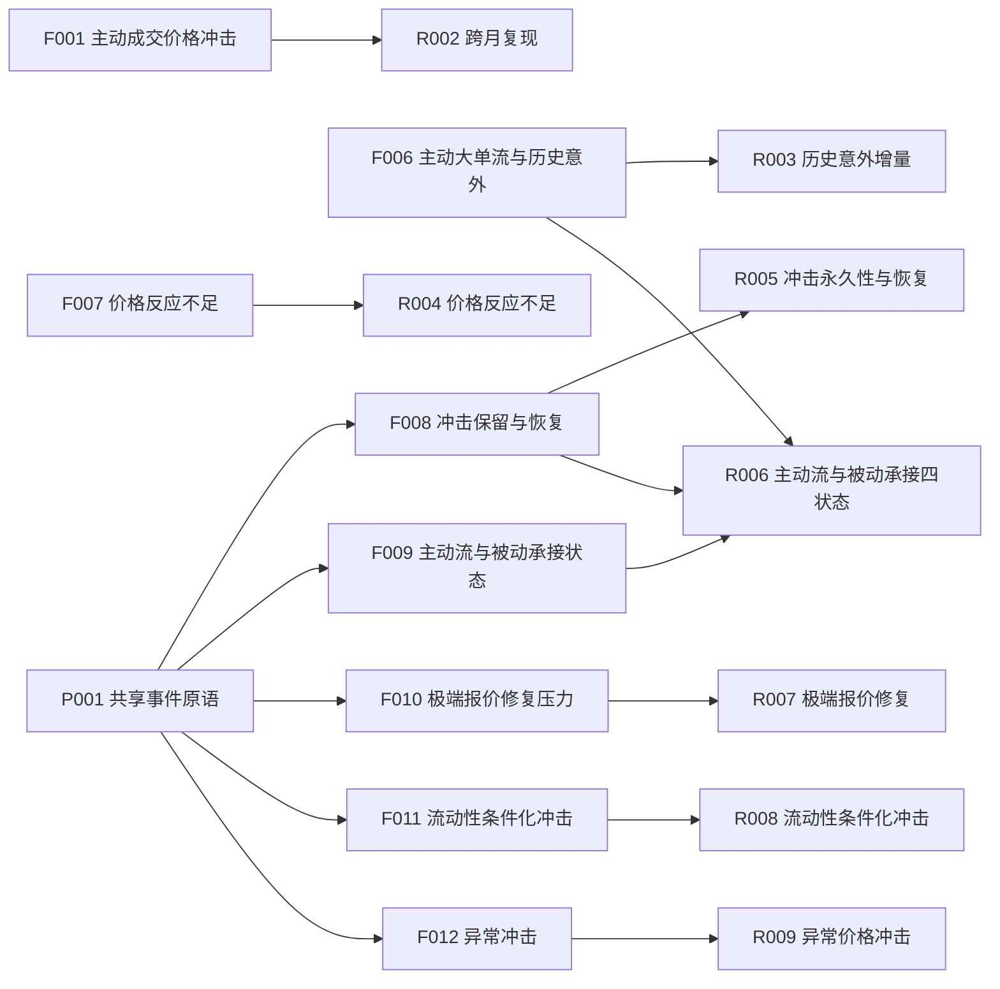
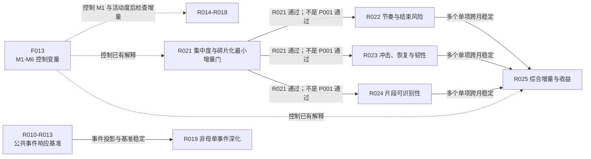
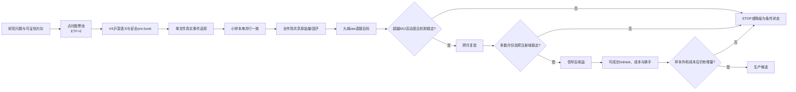

# LOB 因子研究课题总览：内容、方法、进展、结论与依赖

更新日期：2026-08-08

## 1. 文档目的与边界

本文汇总 `research/experiments.json` 中正式登记的 R001–R025 共 25 个研究课题，并说明：

1. 每个课题究竟要回答什么问题；
2. 信号、直接目标和收益标签如何计算；
3. 当前处于定义、因子计算、机制检验还是收益检验的哪一阶段；
4. 现有数据能够支持什么结论、不能支持什么结论；
5. 对后续因子构造、筛选和停止决策有什么启示；
6. 各课题依赖哪些数据产品、因子和前序研究闸门。

本文是研究说明和状态快照，不替代以下正式注册表：

- 因子注册表：`research/factors.json`；
- 研究注册表：`research/experiments.json`；
- 数据产品注册表：`research/data_products.json`；
- 质量门注册表：`research/quality_gates.json`。

需要特别区分三类证据：

- **机制证据**：预测未来订单流、事件数、波动、点差、深度、盘口恢复等直接目标；
- **收益证据**：预测信号形成后的中间价收益或可成交收益；
- **生产证据**：跨月、跨域、样本外及成本后仍然成立。

除 R002 的历史试算外，当前绝大多数结果仍属于机制证据，不能称为已确认的收益 alpha。

---

## 2. 全部课题的统一计算口径

### 2.1 股票池与时间边界

- 使用点时点证券主数据生成的沪深 A 股股票清单，因子计算前排除 ETF；正式产物要求 `ETF=0`。
- 不使用 `event_depth10_v4/<month>/*.parquet` 无限制通配作为股票池。
- 主要日内信号窗口为 `[10:00,10:30)`；非母单订单状态的过去窗口为 `(t-60s,t)`，未来直接目标为 `[t,t+10m)`。
- 时点 `t` 的事件只能进入未来标签，不能进入过去特征。
- 日内风格和九分域暴露默认使用前一交易日可得数据。
- 每个收益期限独立处理缺失标签，不能先取所有未来期限的共同非空样本。

### 2.2 V4 沪深事件语义

V4 每一行都是事件发生后的盘口。事件的 pre-book 必须使用同一股票、交易日和连续竞价时段内最近的有效未交叉盘口。缺失、锁定或交叉行不能覆盖 `last_valid_book`，午休、收盘和换日必须重置。

主动订单键统一为：

\[
OrderKey=(source\_side, ActiveOrderId)
\]

其中买侧取 `source_buy_order_id`，卖侧取 `source_sell_order_id`。买卖订单号空间不能混用，也不能按成交行数重复计算一个主动订单。

- 上海常见顺序是立即成交 `TRADE(s)` 在前、未成交余量 `ORDER_ADD` 在后。后置余量属于同一个主动订单，不能再次算作被动挂单。
- 深圳常见顺序是完整 `ORDER_ADD` 在前、子成交 `TRADE(s)` 在后，中间可能出现临时锁定或交叉 post-book。路径特征比较临时无效链之前的最后有效盘口和链之后的首个有效盘口，不能重排事件。
- `source_link_status`、FULL/PARTIAL 和未来 recid 链接只能用于离线审计，不能进入点时因子。

### 2.3 九分域是主研究维度

使用前一交易日市值分组：

1. `<50亿元`；
2. `50–500亿元`；
3. `>=500亿元`。

与价格/板块分组组合：

1. 非科创板、价格 `<10`；
2. 非科创板、价格 `>=10`；
3. 科创板、价格 `>=10`。

形成九个预冻结域。九域逐一报告是主证据，全市场平均不能掩盖域间反号。交易所差异仍需报告，但必须先排除沪深消息发布和 pre-book 处理差异。

仓库当前默认以各域内 **raw、未做评价中性化** 的结果为第一层证据。风格中性化作为单独标注的稳健性结果，不能覆盖 raw 基准。D04、NP01、D11 等定义内部的残差化属于因子定义，不等于回测阶段自动中性化。

### 2.4 统一研究漏斗

每个候选原则上按以下顺序推进：

1. 字段、事件顺序、时间边界和 ETF 审计；
2. 单文件真实事件核对；
3. 约 12 只股票的小样本及串并行逐字段一致性；
4. 全市场共享原始量或因子计算；
5. 九域内直接目标检验；
6. 控制 M1、活动度和必要的定义内基准后检查增量；
7. 形成继续/停止清单；
8. 只有通过机制闸门的候选才接收益；
9. 最后检查可成交报价、跨月、成本、多重检验和样本外稳定性。

---

## 3. 课题状态总表

| 课题 | 简称 | 当前状态 | 关键依赖 | 现有证据层级 |
|---|---|---|---|---|
| R001 订单形态六机制基线 | M1–M6 | 已完成 | F013、P002 | 直接目标机制 |
| R002 主动成交价格冲击跨月复现 | AG01 | 等 F001 重算 | F001 | 单月初步收益 |
| R003 主动大单流与历史意外增量 | ID05 | 可启动 | F006 | 定义与代码完成 |
| R004 主动大单价格反应不足 | D06 intraday | 定义待定 | F007 | 研究假说 |
| R005 成交冲击永久性与恢复 | D07 | 等 F008 沪市重算 | F008、P001 | 深市机制 |
| R006 主动流与被动承接四状态 | D08 | 上游闸门 | F006、F008、F009 | 研究假说 |
| R007 极端报价修复机制 | D09 | 部分完成 | F010、P001 | 深圳机制，上海待修 |
| R008 流动性条件化冲击 | D10 | 部分完成 | F011、P001 | 深圳机制，上海待修 |
| R009 异常价格冲击增量 | D11 | 上游闸门 | F012、P001 | 研究假说 |
| R010 Imbalance × spread 与下一跳 | ELOB01 | 计划中 | P001 | 无正式结果 |
| R011 多跳价格响应 | ELOB02 | 计划中 | P001 | 无正式结果 |
| R012 信号兑现时间 | ELOB03 | 计划中 | P001 | 无正式结果 |
| R013 Add/Cancel/Trade 事件 IRF | ELOB04 | 计划中 | P001 | 无正式结果 |
| R014 成交机会惊奇 | NP01 | 上游缓存计算中 | F014、P002 | 历史小幅增量 |
| R015 总体可成交性 | NP02 | 上游缓存计算中 | F014、P002 | 无正式结果 |
| R016 主动流与成交机会确认/冲突 | NP03 | 上游缓存计算中 | F014、P002 | 无正式结果 |
| R017 盘口与成交流背离 | NP04 | 上游缓存计算中 | F014、P002 | 历史机制较强 |
| R018 对称撤单强度与流动性风险 | NP05 | 上游缓存计算中 | F014、P002 | 旧定向版本较强 |
| R019 非母单事件机制深化 | NPE01–05 | 上游闸门 | F015、P001 | 无正式结果 |
| R020 近端大单遮挡机制 | DR01–05 | 计划中 | F016、P001 | 完整设计，无结果 |
| R021 执行链集中度与碎片化增量 | MSI-A | 计划中 | F017、F013、P001 | 旧链流被 M1 解释 |
| R022 执行节奏与继续/结束风险 | MSI-B | 等 R021 | F017、R021 | 无正式结果 |
| R023 边际冲击、穿透恢复与韧性 | MSI-C | 等 R021 | F017、R021 | 无正式结果 |
| R024 推断执行片段可识别性 | MSI-D | 等 R021 | F017、R021 | 无正式结果 |
| R025 执行结构综合增量与收益 | MSI-E | 最终闸门 | R021–R024、F013 | 无正式结果 |

---

## 4. 已完成基线与主动冲击课题

### 4.1 R001：订单形态六机制基线（M1–M6）

**研究问题**

订单流、盘口、活动度和被动订单成交机会之间，是否存在跨九域稳定的条件机制？它同时是 NP 和 MSI 系列的共同基准。

**计算方式**

样本为 2026-01 的 300 只点时点 A 股、20 个交易日、每日 21 个固定信号时点。过去特征窗口为 `(t-60s,t)`，直接目标为 `[t,t+10m)`。

普通主动流基准：

\[
M1_t=\frac{ActiveBuyVolume_t-ActiveSellVolume_t}
{ActiveBuyVolume_t+ActiveSellVolume_t+\varepsilon}
\]

M2/M3研究相对刺激和上涨刺激集中度；M4研究强主动流与薄盘口交互；M5研究交易热度与厚盘口状态；M6使用前一交易日及以前被动挂单结果估计买卖两侧成交机会。正向执行压力定义为：

\[
ExecutionPressure_t=PredFillSell_t-PredFillBuy_t
\]

注意缓存中的 `fill_opportunity_diff` 与上式符号相反。

**目前进展与结论**

- M1 对未来 10 分钟主动流的域中性 IC 约为 `0.1412`，九域和 21 个时点方向一致，是强基准。
- M2 买侧相对刺激未复现预设方向，停止原规格。
- M3 上涨刺激集中度未复现；事件时钟只缩小反向结果，停止原规格。
- M4 总体方向与“高强度薄簿”假设相反，低价非科创板是例外。
- M5 对未来 log depth 总体约 `+0.048`，只有 5/9 域较稳定。
- M6 原始 IC 约 `0.0788`；控制三次 M1 后约 `0.0093`，`t=2.40`。
- 三档盘口不平衡预测未来盘口 IC 约 `0.2272`，预测未来主动流 IC 约 `-0.1536`。
- 带方向撤单差预测未来实现波动 IC 约 `0.2820`，但方向解释需要镜像验证。

以上均为直接目标，不是未来收益结论。

**对因子研究的启示**

1. M1 是所有订单结构候选必须超越的基准，不能把活跃度换名后称为新因子。
2. 强 raw IC 在控制 M1 后可能只剩很小增量，增量检验比单变量显著更重要。
3. M4/M5提示价格、tick、市值和深度会改变机制，九域差异不是噪声。
4. 盘口持续而主动流反向响应，说明“盘口—成交流背离”比简单同号组合更值得研究。

### 4.2 R002：主动成交价格冲击跨月复现（AG01）

**研究问题**

主动成交直接推动中间价的极端效应，能否跨月延续，并在可成交价格和成本口径下保持？

**计算方式**

对每个主动成交事件，以安全 pre-book 计算中间价变化 `delta_mid`。主变量包括：

\[
ActiveAbs=\sum_{j\in ActiveTake}|\Delta Mid_j|
\]

\[
ActiveRatio=\frac{\sum_{j\in ActiveTake}|\Delta Mid_j|}
{\sum_{j\in AllEvents}|\Delta Mid_j|+\varepsilon}
\]

以及有符号版本 `sum(delta_mid)`。10:00–10:30 形成信号，检验未来 5/10/15/30 分钟 raw Rank IC、D10-D1、顶部和底部独立收益，并固定 10%/20%/30% 尾宽。

**目前进展与结论**

历史 2026-01 结果中，`old_active_abs` 的 raw D10-D1：未来 10 分钟约 `15.16 bp`、`t=3.99`；未来 15 分钟约 `21.19 bp`、`t=3.69`。ratio 较弱，有符号版本弱。形状更像极端尾部效应而不是线性排序。

但旧实现直接依赖相邻盘口，受深圳临时无效 post-book 影响，F001 已登记为 `safe_prebook_v2` 必重算，因此旧收益只能视为候选线索。

**对因子研究的启示**

- 绝对冲击强度可能比方向更重要，反映信息到达、脆弱性或高活跃状态。
- 显著 D10-D1 但弱线性 IC 通常意味着尾部/阈值结构，应预注册尾宽而非事后选择。
- 这是当前最接近收益候选的方向，但只有跨月、可执行收益和成本后仍成立才能升级。

---

## 5. Stylized-fact 4–6 日内课题

### 5.1 R003：主动大单流与历史意外增量（D04/D05）

**研究问题**

异常主动大单流相对原始主动流是否有增量？相对自身历史异常、加速或持续的主动大单流，是否进一步预测未来订单流或收益？

**计算方式**

先根据只用 `d-1` 及以前数据的大单阈值统计主动大买和主动大卖，形成 `ALF`。D04 是 ALF 对收益、流动性、波动、市值、行业和板块等可得控制量的截面残差：

\[
D04_{i,d}=ALF_{i,d}-\widehat{ALF}_{i,d}(Controls)
\]

D05 的核心历史意外为：

\[
D05_{i,d}=\frac{D04_{i,d}-EWMA_{60}(D04_i)}
{\sigma_{60}(D04_i)+\varepsilon}
\]

并保留 `EWMA3-EWMA20` 加速度、5期持续性、买卖侧 surprise。日内版固定 10:00–10:30，必须具备 60 个严格滞后的同窗口历史观测。

**目前进展与结论**

F006 定义、计算代码和测试已就绪，但尚无正式全市场日内因子和收益结果。既有同期相关只能支持“主动大单与价格冲击相关”，不能支持未来收益。

**对因子研究的启示**

- D04 的残差化是因子定义，不应再隐藏原始 `alf_raw`；两者必须并列报告。
- D05只有在超越 `alf_raw` 和 D04 后才有研究价值，否则只是历史标准化。
- 这是可立即启动、计算成本相对可控的课题。

### 5.2 R004：主动大单价格反应不足（D06 intraday）

**研究问题**

给定异常主动大单流，10:30 前价格反应不足是否预示之后补涨/补跌，反应过度是否预示冲击消退？

**计算方式**

候选方案是将 10:00–10:30 的 D04 与同窗口已实现价格反应构造二维状态，或用严格历史模型估计正常价格响应并取残差。禁止用两个 z-score 相除，也禁止使用 10:30 后价格构造信号。

**目前进展与结论**

F007 尚未实现，点时定义未冻结。日频手册的同步关系约 `+0.65` 只说明主动大单与当日收益同向，不能直接搬成日内未来收益因子。

**对因子研究的启示**

- “流量强但价格不动”可能是隐藏流动性、吸收或尚未兑现，需要和“流量与价格均强”分开。
- 二维状态比不稳定的比值因子更可解释。
- 在定义冻结前不应提交大规模计算。

### 5.3 R005：成交冲击永久性与恢复（D07）

**研究问题**

主动大单的即时冲击在未来是继续、一次性保留还是反转？沪深是否一致？

**计算方式**

对主动大单事件 `j`：

\[
ImmediateImpact_j=Mid_{j+}-Mid_{j-}
\]

\[
RetainedImpact_{j,h}=Mid_{j+h}-Mid_{j-}
\]

\[
PermanentRatio_{j,h}=clip\left(
\frac{RetainedImpact_{j,h}}{ImmediateImpact_j+\varepsilon},-c,c\right)
\]

同时输出 5/30/60 秒、固定事件数的逐事件版本和 atomic-chain 版本，再在 10:30 聚合预测未来 5/10/15/30 分钟。

**目前进展与结论**

深圳 safe-prebook 第一层已有 97,776 个完整股票日、2,884 只股票、ETF=0；5/30/60 秒平均冲击后漂移为正，更接近短期延续，不支持无条件反转。上海仍需修复后置主动余量和统一路径口径，F008 状态为重算所需。

**对因子研究的启示**

- 不能把所有大冲击都解释为反转；必须区分冲击保留、吸收和恢复。
- 交易所差异在语义修复前不能解释为经济差异。
- D07更适合作为其他状态因子的条件变量，而非单独规定固定多空方向。

### 5.4 R006：主动流与被动承接四状态（D08）

**研究问题**

主动大单与被动小单报价改善形成的趋势一致、承接和吸收状态，是否具有不同的冲击保留和未来响应？

**计算方式**

以 D04 表示异常主动大单方向，以 PSF 表示被动小单报价改善方向，构造四个状态：买方一致、卖方一致、买方承接、卖方吸收。使用四个哑变量或二维分组，不能简单压缩为 `D04-PSF`。再用 D07 区分承接成功和失败。

**目前进展与结论**

F009 未定义，且依赖 F006 和 F008 定版，因此尚无正式结果。既有订单行为相关支持两种市场功能不同，但不决定未来收益方向。

**对因子研究的启示**

- 主动流是流动性消耗，被动改善是流动性供给，两者不能当成对称方向因子。
- 状态交互可能比单变量更有解释力；收益方向必须由恢复路径决定。

### 5.5 R007：极端报价修复机制（D09）

**研究问题**

价差内形成的新最优挡位如果相对很薄，是否更容易被再次命中、成交移除并恢复到原盘口？

**计算方式**

每个改善报价事件记录事件前盘口、新最优价、相对历史/附近深度、存活时间、首次再命中、撤单、追加、完全消耗和恢复原盘口。主直接目标为 5秒、30秒、1分钟和固定事件数的存活率、再命中率、成交移除率和恢复率。

所有路径使用安全 pre-book；上海必须排除主动成交后的余量 `ORDER_ADD`，深圳必须跨临时无效链取首个有效 post-book。

**目前进展与结论**

深圳第一层结果显示极薄新挡位更易再命中、成交移除并恢复原盘口。旧上海结果中，极薄组相对 50%–100% 深度组的成交移除率高 `7.94` 个百分点、恢复率高 `9.78` 个百分点、生命周期短 `3.29` 秒；但上海小样本审计发现旧候选中约 `46.4%` 是主动余量，因此上海结论必须重算后确认。

**对因子研究的启示**

- 静态一档深度不够；报价脆弱度、存活、再命中和恢复速度更接近可交易状态变量。
- 稀疏极端状态必须同时报告样本量，不能因结果显著而保留事后分组。

### 5.6 R008：流动性条件化冲击（D10）

**研究问题**

价格、tick、市值和新挡位深度如何改变冲击的延续、吸收和反转？

**计算方式**

将主动流/冲击与 spread、depth、Amihud、换手和波动等流动性状态交互；事件层优先使用价格×市值×新挡位相对深度分层。高流动性下检验信息型延续，低流动性且冲击极端时检验机械冲击恢复。

**目前进展与结论**

深圳第一层显示：低价组内大市值仍提供条件增量；价格效应总体大于市值效应。上海旧结果也显示低价大市值组最突出，但需在报价生命周期修复后重新确认。当前没有正式未来收益结论。

**对因子研究的启示**

- 低价/tick约束和市值共同决定盘口弹性，九域是机制核心而不是纯风险控制。
- D10应以条件状态或交互因子呈现，不能把某个成功域当作全市场结论。

### 5.7 R009：异常价格冲击增量（D11）

**研究问题**

给定正常订单流、深度和价差后，异常大的成交/委托冲击是否预测未来流动性、波动和收益？

**计算方式**

成交端示意：

\[
TradeImpact=\alpha+\beta_1 ALF+\beta_2Depth+\beta_3Spread+\beta_4Volume+\epsilon^{trade}
\]

以 `epsilon_trade` 为异常成交冲击；委托端以 PSF、depth、spread 解释 order impact，取 `epsilon_order`。日内模型参数只能使用历史训练，并同时报告未残差化 primitive。

**目前进展与结论**

F012 未实现，依赖稳定的 D07/D09/P001 原语，尚无正式结果。

**对因子研究的启示**

- 残差首先代表冲击效率或盘口脆弱性，优先预测波动、点差和深度，而不是直接声称知情交易。
- 与 D07 联合可区分“冲击大且永久”和“冲击大但迅速恢复”。

---

## 6. Event-LOB 最小实证课题

四项 ELOB 共用 P001 事件投影。主统计先在“股票×交易日”内计算再等权汇总；pooled event 仅作对照；置信区间至少按交易日 block bootstrap。

基础变量：

\[
Mid_t=\frac{Ask1_t+Bid1_t}{2},\quad
SpreadTicks_t=\frac{Ask1_t-Bid1_t}{TickSize}
\]

\[
Imbalance_t=\frac{BidVol1_t-AskVol1_t}{BidVol1_t+AskVol1_t}
\]

### 6.1 R010：Imbalance × spread 与下一次中价变化

**计算方式**

将 imbalance 主规格分 10 档、20 档作稳健性，spread 分为 1/2/3/4/5+ ticks。标签为下一次有效中价变化是否向上：

\[
Y_t^{up}=1(M_{\tau_1}>M_t)
\]

输出条件上涨概率曲线，并估计：

\[
logitP(Y^{up}=1)=\alpha+\beta_1z+\beta_2S+\beta_3zS
\]

**进展、结论与启示**

正式实验未启动，无结论。它是最小方向信息检验：如果关系不单调、不跨月或只存在于稀疏状态，后续复杂 micro-price 因子不应推进。

### 6.2 R011：多跳价格响应

**计算方式**

定义未来第 `k` 次 mid move 后累计响应：

\[
R_k(z,S)=E[M_{\tau_k}-M_t\mid z_t=z,S_t=S],\quad k\in\{1,2,3,5,10\}
\]

按曲线分为持续型、一次性型和反转型。

**进展、结论与启示**

尚未启动。该课题决定盘口方向信号的持有事件数，也能防止把“只预测下一跳”误写为中期动量。

### 6.3 R012：信号兑现时间

**计算方式**

等待时间 `T=tau_1-t`，统计 1/5/10/30/60 秒内首次 mid move 概率、中位等待时间和 Kaplan–Meier 曲线；分别处理首次上涨与首次下跌的竞争风险。

**进展、结论与启示**

尚未启动。方向正确但兑现过慢的状态可能没有 T0 价值；事件时间稳定也不代表自然时间可交易。

### 6.4 R013：Add/Cancel/Trade 事件价格 IRF

**计算方式**

事件规模用事件前同侧最优队列标准化：

\[
RelativeSize_t=\frac{EventSize_t}{QueueSize_{t-}}
\]

分别计算未来 1/2/5/10/20/50/100 个事件和 1/5/10/30/60 秒的累计中价响应；做买卖镜像及 imbalance/spread 交互。

**进展、结论与启示**

尚未启动。它为 NPE、D07、D09/D10 提供共同基准：相同盘口变化由 Add、Cancel 或 Trade 触发时，信息含量和恢复路径可能不同。

---

## 7. 非母单订单状态候选（R014–R018）

这五项不研究隐藏母单，也不需要重新扫描原始 LOB；它们读取固定 10:30、带历史模型指纹的 P002 缓存。当前全市场缓存目标为 5,160 只股票×20日，完成后最多 103,200 行信号。

### 7.1 R014：成交机会惊奇（NP01）

**计算方式**

\[
ExecutionPressure_t=PredFillSell_t-PredFillBuy_t
\]

在日期×时点×域内控制 `M1, M1^2, M1^3` 和预注册控制量：

\[
NP01=ExecutionPressure-\widehat{ExecutionPressure}(M1,M1^2,M1^3,Controls)
\]

先预测未来 10 分钟主动净流、主动量和事件数，再决定是否接 1/5/10 分钟收益。

**进展与结论**

全市场 P002 正在计算，正式 R014 尚未开始。历史 300 股结果中控制 M1 后 IC 约 `0.0093`、`t=2.40`，属于小幅、域依赖的探索性增量。

**因子启示与闸门**

如果全市场或跨月不能复现稳定的未来订单流增量，直接停止，不通过调整符号、分组或模型复杂度挽救。

### 7.2 R015：总体可成交性（NP02）

**计算方式**

\[
FillabilityLevel=\frac{PredFillBuy+PredFillSell}{2}
\]

另做两侧 logit 均值稳健版本。控制当前主动量/笔数、两侧历史样本数、spread、三档深度、时段和域，预测未来事件数、成交量、波动、点差和深度。

**进展、结论与启示**

等待 P002 完成，无正式结果。它是无方向活动/流动性状态；若只复制当前成交量和点差则停止，不应强行方向化。

### 7.3 R016：主动流与成交机会确认/冲突（NP03）

**计算方式**

连续交互：

\[
Confirmation=M1\times ExecutionPressure
\]

同时构造预注册四状态：两者同向且强、M1弱/M6强、M1强/M6反向、两者均弱。优先检验 `M1强、M6反向` 是否对应订单流衰减或价格反转。

**进展、结论与启示**

等待 P002，无正式结果。阈值必须由历史期或当期截面规则冻结；若依赖目标月阈值或状态过稀疏则停止。

### 7.4 R017：盘口与成交流背离（NP04）

**计算方式**

\[
BookImbalance3=\frac{BidDepth3-AskDepth3}{BidDepth3+AskDepth3}
\]

构造 M1×BookImbalance3 二维状态，以及当前主动流相对历史盘口—流量关系的残差。先预测未来盘口、主动流和波动，再接收益。

**进展与结论**

等待 P002。历史结果已经显示盘口自身持续而未来主动流反向，是当前机制基础最强的 NP 候选之一，但尚无收益证据。

**因子启示与闸门**

价值在“状态背离”而不是把盘口不平衡重新缩放；若控制盘口不平衡后没有增量则停止。

### 7.5 R018：对称撤单强度与流动性风险（NP05）

**计算方式**

\[
CancelIntensity=\frac{NearCancelBuy+NearCancelSell}
{BidDepth3+AskDepth3+\varepsilon}
\]

\[
AbsCancelImbalance=\frac{|NearCancelSell-NearCancelBuy|}
{NearCancelSell+NearCancelBuy+\varepsilon}
\]

同时保留买侧/卖侧按本侧深度归一化的 shock。主目标是未来实现波动、点差扩大和深度下降，而非涨跌方向。

**进展与结论**

等待 P002。旧带方向撤单差对未来实现波动 IC 约 `0.2820`，数值强但可能混合撤单总量和方向编码。

**因子启示与闸门**

必须通过买卖镜像：对称量交换后不变，有符号量严格反号；总量和方向差分别入模。只有旧带方向版本有效而对称版本失效时，应停止通用解释。

---

## 8. 非母单事件深化与遮挡机制

### 8.1 R019：非母单事件机制深化（NPE01–05）

R019包含五个共享一次 P001 扫描的子问题：

| 子方向 | 核心计算 | 主要直接目标 |
|---|---|---|
| NPE01 流动性吸收 | 主动量相对中价变化和深度损失 | 后续延续/反转、恢复 |
| NPE02 冲击效率 | 单位主动量价格变化、穿透档位 | 价格脆弱性 |
| NPE03 历史恢复能力 | 已完成冲击后的补单、点差和深度恢复 | 后续成本与韧性 |
| NPE04 日内热度惊奇 | 当前事件数/成交量相对历史同时段基线 | 未来活动和波动 |
| NPE05 秒时钟与事件时钟差异 | 同一状态在自然时间和事件时间的差 | 活动压缩和波动 |

**目前进展与结论**

F015 尚未实现，依赖 P001 事件投影稳定。现有 M4/M5 和 D07–D10 结果只提供研究动机，尚无 R019 正式结论。

**对因子研究的启示**

相同主动流对价格的作用取决于吸收、穿透和恢复；这些变量有机会比继续构造更多净流指标更具增量。单月或单域显著不能直接进入收益阶段。

### 8.2 R020：近端大单遮挡机制（DR01–05）

**研究问题**

近端异常被动大单出现后，价格优先是否降低同侧更差价格既有订单的成交机会，进而提高这些深档订单的异常撤单风险？

**计算方式**

主触发为买/卖侧前 2 档的原价扩量被动订单。规模必须同时满足历史同类订单前 5% 且不低于该位置典型深度；历史阈值只用 `d-1` 及以前数据。目标集合只包含触发前已存在、同侧、严格劣于触发价且在后方 1–5 ticks 的订单。

事件级撤单率：

\[
C_e^{deep}(h)=\frac{\sum_{o\in O_e^{deep}}CancelQty_o}
{\sum_{o\in O_e^{deep}}RemainingQty_{o,e}+\varepsilon}
\]

以仅含事件前变量的历史模型估计基准撤单率，形成：

\[
ACR_e=C_e^{deep}-\widehat C_e^{base}(X_e^{pre})
\]

再聚合为 DR01 无方向异常响应、DR02 买卖方向差、DR03 持续大单可信度、DR04 大单消失后的流动性空洞、DR05 规模—撤单响应弹性。

**目前进展与结论**

F016 只有完整设计，尚未实现和计算。目前不能声称遮挡机制存在。

**对因子研究的启示与停止规则**

最小实验必须同时看到：事件后撤单风险上升、成交或触价风险下降、效应随大单规模和持续性增强、事件前不存在同样趋势。若最小版本失败，不进入复杂订单生命周期和收益优化。

---

## 9. 执行链与推断执行片段课题

公开 LOB 能直接看到的是订单链 L0，可以算法推断市场级同向片段 L1，但不能恢复真实投资者意图 L2。因此本文避免把单一 `active_order_id` 或算法片段直接称为真实母单。

现有 2026-01、300股结果中，固定时点 `chain_flow` 的域中性 IC 为 `0.1406`，但控制普通主动流和四风格后变为 `-0.0083`；M1和控制变量解释约 `98.5%` 的域内截面方差。这否定的是“链净流重新命名”，不是所有链结构。

### 9.1 R021：执行链集中度与碎片化增量（MSI-A）

**计算方式**

\[
ChainHHI=\sum_i\left(\frac{V_i}{\sum_jV_j}\right)^2,
\quad MaxChainShare=\frac{\max_iV_i}{\sum_jV_j}
\]

\[
Fragmentation=\frac{K}{\log(1+ActiveVolume)},
\quad ChainEntropy=-\sum_i p_i\log p_i
\]

所有变量在日期×时点×域内控制 M1、M1非线性、活动度、spread、depth 和必要风格，检验控制后直接目标增量。

**进展、结论与启示**

F017尚未实现，正式R021未启动。它是整个执行结构系列的第一道闸门：如果集中度、碎片化和熵仍被 M1/活动度解释，R022–R025不应投入复杂模型。

### 9.2 R022：执行节奏与继续/结束风险（MSI-B）

**计算方式**

\[
TempoAcceleration=\log\frac{\lambda_{late}+\varepsilon}
{\lambda_{early}+\varepsilon}
\]

并使用 `d-1` 及以前片段估计 continuation probability 和 termination hazard。输入只能包括截至当前可知的持续时间、子成交数、节奏、价格推进、反向流和盘口，不能使用最终片段长度。

**进展、结论与启示**

等待 R021。先使用历史条件表或生存模型；只有样本外优于简单持续时间基线，才考虑 HMM/HSMM 或点过程。

### 9.3 R023：边际冲击、穿透恢复与吸收韧性（MSI-C）

**计算方式**

\[
ImpactEfficiency=\frac{|\Delta Mid|}{\log(1+EpisodeVolume)}
\]

\[
MarginalImpactDecay=ImpactPerVolume_{early}-ImpactPerVolume_{late}
\]

\[
RecoveryRatio=\frac{ReplenishedOppDepth}{DepletedOppDepth+\varepsilon},
\quad Absorption=\frac{ActiveVolume}{|\Delta Mid|+\varepsilon}
\]

实时特征只能使用信号前已经完成的冲击—恢复历史；信号后的追价、补单和恢复只能作为标签。

**进展、结论与启示**

等待 R021，无正式结果。它研究的是相同主动流下盘口是否逐渐吸收、恢复或被穿透，理论上比链方向更可能提供结构增量。

### 9.4 R024：推断执行片段可识别性（MSI-D）

**计算方式**

第一版为规则型在线状态机，以同向连续性、时间接近、价格路径、规模模式和反向流形成可解释 EpisodeScore。用隐藏已知订单 ID 的弱监督任务检验 pairwise precision/recall，并做顺序打乱、订单 ID 打乱和日期错配 placebo。

频域只作为节奏特征：去均值流序列加窗后计算非零低频能量占比和频谱熵；零频项与 M1 重合，必须去除。

**进展、结论与启示**

等待 R021。规则基线未证明增量前不使用深度序列模型；即使能够恢复 L0，也不能证明 L1 等于真实投资者母单。

### 9.5 R025：执行结构综合增量与收益（MSI-E）

**计算方式**

每个结构变量先控制：

\[
\{M1,M1^2,M1^3,ActiveVolume,ActiveCount,Spread,Depth,Controls\}
\]

只把跨月稳定的结构残差纳入：

\[
MSI10=\sum_k w_k Z(StructureResidual_k)
\]

第一版等权或使用预注册方向权重，不按目标月表现优化。

**进展、结论与启示**

这是最终闸门，必须等待 R021–R024 中多个单项通过直接目标、placebo 和跨月验证后才启动。最终还需 raw收益、可成交收益和成本后收益。当前没有结果。

---

## 10. 从现有研究提炼出的因子研究原则

### 10.1 先问“增量”，再问“显著”

M6 从 raw IC `0.0788` 降到控制 M1 后 `0.0093`，chain_flow 约 `98.5%` 被 M1和控制量解释，说明高单变量 IC 很容易只是普通主动流或活动度代理。所有订单结构变量都应报告控制前后效果和被基准解释的 `R^2`。

### 10.2 九域差异是经济机制，不是需要消掉的噪声

M4、M5、D09、D10均显示价格/tick、规模和盘口深度会改变机制。应先完整报告九域，再解释各域的流动性、tick约束和参与者结构；不能只挑成功域合并，也不能用全市场中性化掩盖反号。

### 10.3 状态、交互和尾部可能优于线性排序

active_abs 更像尾部效应；M4/M5、D08、NP03、NP04都自然对应二维状态。研究应优先使用预注册二维分组、连续交互和固定尾宽，而非事后寻找最优阈值。

### 10.4 方向因子与风险因子要分开

总体可成交性、撤单强度、冲击效率和报价脆弱度首先预测活动、波动、点差和深度。无方向变量若能稳定预测风险，也具有研究价值，不必强行映射成涨跌方向。

### 10.5 直接目标是高成本研究的筛选器

先检验未来流量、活动、波动、点差、深度和恢复，可以较早否定机制。只有机制通过者才接收益，能够减少全市场多期限回测和多重检验负担。

### 10.6 交易所差异必须先经过语义审计

上海 trade-before-remainder 和深圳 add-before-trade/临时交叉会制造机械差异。只有分别通过安全 pre-book、主动余量分类和交易所 QC 后，才能解释为经济差异。

### 10.7 一个显著月份只能决定“继续”，不能决定“上线”

生产候选至少需要跨月、预注册方向、完整九域、样本外、可成交报价、成本和多重检验说明。机制 IC、mid-price 响应或单月 D10-D1 都不能单独证明可交易 alpha。

---

## 11. 课题依赖关系图

### 11.1 数据产品、因子与研究课题依赖

先区分四类编号。括号中的 D07、NP01、MSI-A 等是旧文档或研究系列的别名，不是第五类对象。

| 前缀 | 对象 | 作用 | 例子 |
|---|---|---|---|
| Q | 质量门 | 判断输入、语义和实现是否可信；不产生研究结论 | Q003 沪深事件语义与 safe pre-book |
| P | 共享数据产品 | 保存多个因子或课题复用的中间数据；本身不回答研究问题 | P001 共享 LOB 事件与生命周期原语 |
| F | 因子或一组紧密相关的候选定义 | 规定实际计算的信号、状态或控制变量 | F013 非母单订单状态基准 M1–M6 |
| R | 研究课题 | 使用 P/F 检验一个可证伪问题，并作继续或停止决策 | R021 集中度与碎片化增量 |

阅读依赖时使用以下方向：

```text
适用的 Q 通过 → 生成 P 或直接计算 F → R 使用这些输入回答研究问题
```

并非每个因子都必须经过 P001 或 P002。F001、F006、F007 等可以在通过各自适用的 Q 后直接从审计输入计算。各对象的精确依赖仍以 `research/*.json` 注册表为准。

#### 11.1.1 计算输入依赖

下表只表示“计算或实证时要读取什么”，不表示前序研究已经成功。

| 研究族 | 共享数据输入 | 因子或控制 | 使用它们的课题 |
|---|---|---|---|
| 非母单订单状态基线 | P002 | F013（M1–M6） | R001 |
| 非母单订单状态候选 | P002 | F014（NP01–NP05）；F013 用作增量控制 | R014–R018 |
| 主动冲击与 stylized facts | 部分因子直接读取审计输入；F008–F012 使用 P001 | F001、F006–F012 | R002–R009 |
| Event-LOB 最小实证 | P001 | 共用事件投影，不另设一个汇总因子编号 | R010–R013 |
| 非母单事件深化 | P001 | F015（NPE01–NPE05） | R019 |
| 近端大单遮挡 | P001 | F016（DR01–DR05） | R020 |
| 执行结构 | P001 | F017（MSI01–MSI10）；F013 用作增量控制 | R021–R025 |

其中主动冲击分支的逐项对应为：



#### 11.1.2 研究闸门与控制关系

下图不是数据加工链。箭头表示“前一项达到停止规则要求后，才值得投入后一项”。虚线表示只作为基准或增量控制，不是候选因子的计算输入。



这里不再用“P1 通过”表示 R021 的第一阶段检验，以免与数据产品 P001 混淆。各课题当前是完成、计算中、部分完成还是被上游阻塞，统一查看第 3 节状态总表，不再用依赖图颜色重复编码。

### 11.2 从候选到生产因子的研究闸门



---

## 12. 当前建议执行顺序

1. 完成 P002 全市场固定10:30缓存，校验完成清单、ETF=0、沪深覆盖和输出哈希。
2. 不重读 LOB，直接实施 R014–R018 的九域 raw 直接目标检验，形成继续/停止表。
3. 并行准备 R003 的 D04/D05 正式计算，因为 F006 已就绪且不依赖当前 pre-book 修复。
4. 完成 F001、F008、F010、F011 的安全 pre-book/上海主动余量修复，随后推进 R002、R005、R007、R008。
5. P001 稳定后先做 R010–R013，形成 NPE、DR 和 MSI 共用事件响应基准。
6. R021 只做集中度/碎片化的最小增量门；失败则停止 R022–R025，避免投入高成本隐藏片段模型。
7. 只有直接目标通过者进入收益、可成交报价和成本阶段。

---

## 13. 主要依据

- `research/experiments.json`
- `research/factors.json`
- `research/data_products.json`
- `docs/EXPERIMENT_PLAN.md`
- `docs/HANDOFF_NON_PARENT_ORDER_SHAPE_NEXT_SESSION.md`
- `docs/HANDOFF_D04_D06_NEXT_SESSION.md`
- `docs/Event_LOB最小实证实验方案.md`
- `docs/stylized-fact-4-6_日频因子手册.md`
- `docs/近端大单遮挡与深档撤单响应因子设计文档.md`
- `docs/母单结构与执行阶段_衍生因子研究手册.md`
- `docs/沪深pre-book口径审计与重算计划.md`
